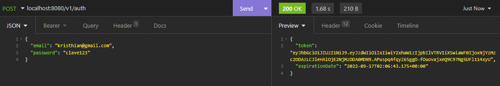

# Spring Boot Security with JWT

### Learning Objectives

- Explain how JWT works.
- Implement the security of the API endpoints using JWT

Our API Endpoints can be used by anyone that knows the URL and API structure. In order to secure our API we are going to implement JWT authentication.

### Main Topics
- Spring Security.
- JWT.
- Token.

### Codelab 🧪

#### Add a new user

#### Open endpoint

#### Secure endPoint

#### Generate the token 

#### Access to the user endpoint with the token 

